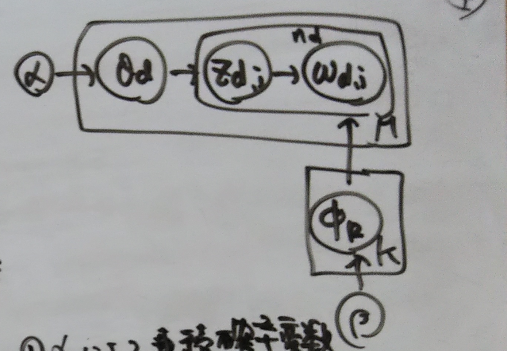

```{r setup, include=FALSE}
knitr::opts_chunk$set(echo = TRUE)
```

## R Markdown
# 2章
## 2.1 概要
Latent Dirichlet Allocation (LDA)は潜在的ディリクレ配置と訳される（かな？）
単語（WORD）の集合として、Bag of Word(BoW)を考える。
単語の出現頻度のペア集合をモデル化。
共起しやすい単語の生成要因を
観測できない確率変数として潜在トピックとする。

### LDAの仮定
文書には複数の潜在トピックがある→離散分布モデル

他にも、潜在トピックモデルとしては
購入履歴をBag of Item としてモデル化して、表層に現れないアイテムも抽出ができる。
音声や画像・情報検索、ソーシャルネットワーク解析などのデータもBag of XXX表現で変換できる

### 階層ベイズモデル
$\overrightarrow{\pi}$を単体（simplex）とする。
単体は総和が１になる空間である（確率変数空間に適する）

そして、この単体の中での$\overrightarrow{\pi}$の分布を決める確率モデルが
Dirichlet分布である。
$$
p(\overrightarrow{\pi}|\overrightarrow{\alpha})=Dir(\overrightarrow{\pi}|\overrightarrow{\alpha}) = \frac{\Gamma(\Sigma\alpha_k)}{\Pi~\Gamma(\alpha_k)}\Pi\pi^{\alpha_k -1}_k
$$
ガンマ関数$\Gamma(n)$の性質：
$$
\Gamma(1) = 1\\
\Gamma(n) = (n-1)\Gamma(n-1)=(n-1)!\\
\Gamma(\alpha + n) = (\alpha + n-1)\Gamma(\alpha +n-1)\\
\alphaは非負実数、n\geq2の整数
$$
期待値、分散は
$$
E[\pi_k] = \frac{\alpha_k}{\alpha_0}\\
V[\pi_k] = \frac{\alpha_k(\alpha_0-\alpha_k)}{\alpha_0^2(1+\alpha_0)}\\
\alpha_0 = \Sigma^K_{k=1}\alpha_k
$$


### 共役事前分布
Dirichlet分布は
多項分布の共役事前分布

$p(x)$を$p(y|x)$の共役事前分布とする。
事後分布$p(x|y)\propto p(y|x)p(x)$の分布が$p(x)$と同分布になる時、
$p(x)$は$p(y|x)$の共役事前分布という

例）
$$
p(x_i|\overrightarrow{\pi})=\Pi_{k=1}^K\pi_k^{\delta(x_i=k)}\\
(ex.~~ x_2の確率はp(x_2|\overrightarrow{\pi})=\pi_2)\\
\overrightarrow{\pi}というベクトルを作る同時確率は前述のDirichlet分布の式を用いて\\
p(\overrightarrow{\pi}|\overrightarrow{\alpha})\propto\Pi_{k=1}^K\pi_k^{\alpha_k-1}\\
途中導出は、本テキストを参照いただき、結果は\\
p(\overrightarrow{\pi}|\overrightarrow{x},\overrightarrow{\alpha})\propto\Pi_{k=1}^K\pi_k^{n_k+\alpha_k-1}
$$


となる。
これは、$n_k+\alpha_k$をパラメータとするDirichlet分布である（→共役事前分布になっている）
こうなるための前提は、
事後分布の計算式で観測値の期待値$p(x|\overrightarrow{\pi})$が$\overrightarrow{\pi}$に独立に結びつき、事前分布がDirichlet分布だからである。ある意味シンプルなモデル。

また、確率は総和が１であるので、
$$
\int~p(\overrightarrow{\pi}|\overrightarrow{x},\overrightarrow{\alpha})d\pi=1
$$

との条件を入れて

$$
p(\overrightarrow{\pi}|\overrightarrow{x},\overrightarrow{\alpha})=\frac{\Pi_{k=1}^K\pi_k^{n_k+\alpha_k-1}}{\int~p(\overrightarrow{\pi}|\overrightarrow{x},\overrightarrow{\alpha})d\pi}
$$

になる。しかしながら、この確率の分布がDirichlet分布であることがわかっているので、
この積分を計算する必要はなく、dirichlet分布の公式から

$$
p(\overrightarrow{\pi}|\overrightarrow{x},\overrightarrow{\alpha})= \frac{\Gamma(\Sigma_{k=1}^K(n_k+\alpha_k))}{\Pi_{k=1}^K~\Gamma(n_k+\alpha_k)}\Pi\pi^{\alpha_k -1}_k
$$

となる。

この式から$\alpha_k$は、観測前のkの仮想的頻度と見ることができる。
本当かな？

## 考察

$\alpha_k$で、$\overrightarrow{\pi}$がDirichlet分布によって決まる。  
$\overrightarrow{\pi}$はkの事象が出る確率を表している。  
一方で上記の式は事後分布としての  
観測された$x$と$\alpha_k$で$\overrightarrow{\pi}$を推定している。  
つまり、前と後ろで挟んで推定している。  
$\alpha_k$は仮説的頻度であり、→　制約  
$n_k$は観測された頻度である。→　制約  
事後分布の$n_k+\alpha_k$は両方の制約による補正と考えられるか  
Dirichlet分布は、この制約には関係なく数理モデルに落とし込みための手法である。

## 計算
p.28の(2.7)に出てくる
$$
p(\overrightarrow{\pi}|\overrightarrow{x},\overrightarrow{\alpha})=\Pi_{i=1}^N\Pi_{k=1}^K\pi_k^{\delta(x_i=k)}
$$
は具体的にどのような形なのだろうか？

$$
\Pi_{i=1}^N\Pi_{k=1}^K\pi_k^{\delta(x_i=k)}\\
=\Pi_{k=1}^K(\pi_k^{\delta(x_1=k)}\cdot\pi_k^{\delta(x_2=k)}\cdot\cdot\cdot\pi_k^{\delta(x_N=k)})\\
=\pi_k^{\delta(x_1=1)}\cdot\pi_k^{\delta(x_2=1)}\cdot\cdot\cdot\pi_k^{\delta(x_N=1)}\\
+\pi_k^{\delta(x_1=2)}\cdot\pi_k^{\delta(x_2=2)}\cdot\cdot\cdot\pi_k^{\delta(x_N=2)}\\
+ \cdot\cdot\cdot \\
+\pi_k^{\delta(x_1=K)}\cdot\pi_k^{\delta(x_2=K)}\cdot\cdot\cdot\pi_k^{\delta(x_N=K)}\\
$$

これはシンプルな独立事象の同時確率の式。
つまり、

$$
if~\overrightarrow{x}=(1,1,1)\\
p(\overrightarrow{\pi}|\overrightarrow{x},\overrightarrow{\alpha})=\pi_1^{1+1+1}

$$

$$
if~\overrightarrow{x}=(1,0,1)\\
p(\overrightarrow{\pi}|\overrightarrow{x},\overrightarrow{\alpha})=\pi_1^{1+0+1}
$$
$$
if~\overrightarrow{x}=(1,2,K)\\
p(\overrightarrow{\pi}|\overrightarrow{x},\overrightarrow{\alpha})=\pi_1^{1}\cdot\pi_2^{1}\cdot\pi_K^{1}
$$


## LDAの生成過程

$\phi_{k,\upsilon}$をトピック$k$における単語$\upsilon$の出現確率とする。
$$
\Upsilon = \{1,2,...,V\}\\
\phi_k = \{\phi_{k,1},\phi_{k,2},...,\phi_{k,V}\}
$$
文書には明確にトピックの情報があるわけではない。
そのため、潜在的トピックとして抽出する。

文書$d$の$i$番目の単語を$w_{di}$として
対応する潜在変数を$z_{di}$とする。
$z_{di}\in\{1,2,...K\}$としてトピック数に等しい

各単語は、離散値をとる潜在変数を背後に保持している。
→　単語はなんらかのトピックに属して、そこでの出現確率分布によって
単語の$w_{di}$の発生確率$\phi_{k,\upsilon}$が決まる。
同じ潜在変数と推定されたら、その単語群は同一のトピックと見なす。

そして、一つのトピックに着目すると
その中で単語の発生確率の高い順に並べれば
そのトピックの特徴がわかる。

$M$を文書数、  
文書$d$の文書長を$n_d$、
$\theta_{d,k}$を文書$d$におけるトピック$k$の出現確率として
$\overrightarrow{\theta_d}=(\theta_{d,1},\theta_{d,2},...,\theta_{d,K})$
として、必ずいずれかのトピックが出るとすれば、これは単体である。

改めて、$\phi_{k,\upsilon}$をトピック$k$における単語$\upsilon$の出現確率
$$
\theta_d \sim~Dir(\overrightarrow{\alpha}),~~~~(d = 1,2,...,M)\\
\phi_{k}\sim~Dir(\overrightarrow{\beta}), ~~~(k = 1,2,...,K)
$$

単語$w_{di}$や潜在変数$z_{di}$は共に離散値であるため、
多項分布で仮定する。


$$
z_{di}\sim~Multi(\overrightarrow{\theta_d})\\
w_{di}\sim~Multi(\overrightarrow{\phi_{k}})
$$
参考：https://pandoc.org/MANUAL.html#extension-link_attributes
{height=4cm}


$\alpha$によって、連続確率変数$\theta_d$が生成される。  


$\theta_d$の下で潜在確率変数$z_{di}$が生成される。  
$z_{di}$に応じて、そのトピックに属する$w_{di}$が観測される。  
→　ルートAとする  
一方で、  
$\beta$によって、$\phi_{k,\upsilon}$が生成される。
この$\phi_{k,\upsilon}$によっても$w_{di}$が制約されて観測される。  
→　ルートBとする

### どう解釈するか
ルートAでは、$z_{di}$というトピックが文書中で次に出てくる単語の候補（単語集合）
を決める。なぜなら、$z_{di}$はそのトピックに属する単語のどれが観測されるかの
確率分布情報は持っていない。
ルートBの$\phi_{k,\upsilon}$はトピックkでの単語の生起確率を与えるので、
$\phi_k = \{\phi_{k,1},\phi_{k,2},...,\phi_{k,V}\}$で、そのトピック内での
生起しやすい単語がわかる。
つまり、ルートAで次に生成される単語の属するトピックを$z_{di}$として選択し、
ルートBで、そのトピックに属する単語群から
実際に観測される単語を確率的に生成していると考えることができる。

どうやって、トピック潜在変数や単語の生起確率を推定するかは今後学ぶ。

## LDAの幾何学的解釈
例えば、３つの単語play,game,musicのみがある文章を考える。
そして、それらの発生頻度がそれぞれ以下の場合の文書２例を考える。
$$
f_a (play, game, music)=(5,10,0)\\
f_b (play, game, music)=(8,0,7)
$$
３単語のみの文書であるので、確率として表現すると
$$
p_a =(5/15, 10/15, 0)\\
p_b =(8/15, 0    , 7/15) 
$$
これらは、
$$
p_1(play,game,music)=(1,0,0)\\
p_2(play,game,music)=(0,1,0)\\
p_3(play,game,music)=(0,0,1)\\
$$
を基底ベクトルとする単語座標単体上の座標である。
すなわち、文書情報を単語座標単体に射影していることになる。

各文書が意味のある文脈をもつ場合、  
その文書座標は単語座標単体上に一様に分布するとは考えにくい。
上記の例では、”試合をする”という文脈をもつ文書は[play]と[game]の結ぶ軸周辺に分布すると考えられる。→イメージすると$f_a (play, game, music)=(5,10,0)$、$f_a (play, game, music)=(6,9,0)$、$f_a (play, game, music)=(4,9,2)$（わかりやすいように文書中の単語数を正規化している）


一方で、”音楽を奏でる”という文脈をもつ文書座標は[play]と[music]の結ぶ軸周辺に分布するだろう。

これら文書の分布としては結果として偏りをもち、その偏りを利用して、より低次元の単体で表現することができる（主成分分析PCAにちかいイメージか？）。

この低次元の単体を潜在トピック座標単体と呼ぶ。
この潜在トピック座標単体の基底ベクトルは元の単語座標単体上の点であり、単語ベクトルである。
例えば、
$$
p_1'(play,game,music)=(5/15,8/15,2/15)\\
p_2'(play,game,music)=(8/15,1/15,6/15)
$$

の二つが基底ベクトルになる（数字は例）
そして、LDAではこの基底てベクトルが$\phi_{k,\upsilon}$になっている。つまり、上記の場合、
$p_1'$
が”試合をする”というトピック中の単語の発生確率のベクトルになっている。
$$
\phi_{play,game} = p_1'(play,game,music)=(5/15,8/15,2/15)
$$

$p_2'$が”音楽を奏でる”というトピック中の単語の発生確率のベクトルになっている。
$$
\phi_{play,music} = p_2'(play,game,music)=(8/15,1/15,6/15)
$$

また、文書ごとのトピック分布$\overrightarrow{\theta_d}$はこの潜在トピック座標単体上の点になる。


## 2.5 LDAの応用例
### 予測としての用途
予測変換システムや文書の推薦システムに活用できる。

ある文書におけるトピックの出現確率と、あるトピックにおける単語$\upsilon$の出現確率を以下のように簡略化する
$$
\theta_{d,k}=p(k|d)\\
\phi_{k,\upsilon}=p(\upsilon|k)
$$
以上によると、文書dでの単語$\upsilon$の発生確率は以下のようになる
$$
p(\upsilon|d)=\Sigma_{k=1}^Kp(\upsilon|k)p(k|d)
$$
この式ではトピックを仲介しているので
文書中に発生していない単語でも発生確率として算出することができる。


単語qをクエリとして、関連度の高い文書集合をランキングする。
$p(q|d)$を用いて、文書dをランキングする。

推薦システムとして。
LDAはBagOfXXXという形で、統計モデルを考える。
ここでiをアイテム、uをユーザーとする。
$$
p(i|u)=\Sigma_{k=1}^Kp(i|k)p(k|u)
$$
これはこれまでの購入履歴（ユーザーの潜在的嗜好）というトピックを用いてそれと共起するアイテムを予測することになる。

ユーザが評価値を与えるシステムの場合、頻度データではないため、LDAを拡張して対応することができる。


### 潜在情報検索としての用途
時系列的に潜在変数から推定されるトピックの変化を追跡。
また、各単語と潜在変数を入れ替えると文書の圧縮ができるらしい（よくわからん）


